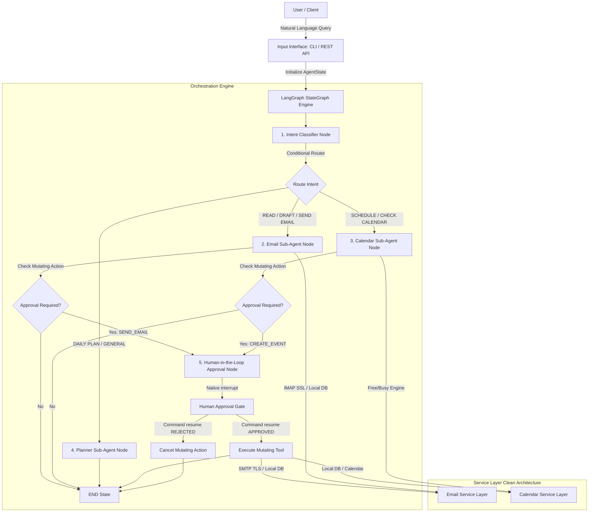
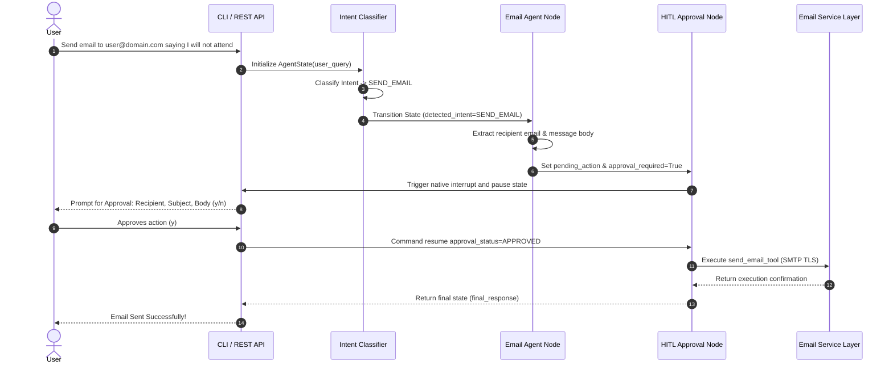

# 🤖 AI Email & Calendar Assistant using LangGraph

An autonomous, token-efficient AI Executive Assistant capable of managing emails, calendar events, scheduling meetings, drafting replies, summarizing inboxes, and constructing daily productivity plans.

This is **NOT a simple chatbot** and **NOT just a wrapper around API endpoints**. It is a full-fledged **Agentic AI system** built with **LangGraph** that reasons about user intent, plans actions, interacts with external/local services, and enforces **Human-in-the-Loop (HITL)** approval before performing mutating real-world actions.

---

## 📐 System Architecture & Agent Workflow

### 1. High-Level System Architecture



---

### 2. LangGraph State Evolution Flowchart



---

## 🎓 Key Technical Learnings

Through building this project from scratch, you have mastered:

### 1. Autonomous Agentic AI vs Chatbots
- **Chatbots** simply output text responses sequentially.
- **Agentic AI Systems** maintain state, make multi-step decisions, execute external tools, handle conditional branches, and pause for human authorization before altering external state.

### 2. LangGraph State Orchestration
- **`AgentState` TypedDict Design**: Using `Annotated[List[Any], add_messages]` to automatically append chat messages while isolating intent, email contexts, calendar availability, and HITL flags.
- **Conditional Edge Routing**: Routing nodes dynamically based on intent (`route_intent`) and execution status (`route_after_agent`).
- **Thread State Persistence**: Using `MemorySaver()` checkpointer to save state across turns and inspect active execution graph states.

### 3. Production Human-in-the-Loop (HITL) Execution
- Using native **`langgraph.types.interrupt()`** to safely pause graph execution when a mutating tool (e.g. `send_email_tool`, `create_event_tool`) is proposed.
- Resuming graph execution state cleanly using **`Command(resume={"approval_status": "APPROVED" | "REJECTED"})`**.

### 4. Token Efficiency Strategies
- **Context Pruning**: Truncating email bodies to 400 characters max before feeding into prompts.
- **Offloading Calculations**: Using local Python utility tools (`resolve_relative_date_tool`, `contact_lookup_tool`) for date math and contact matching instead of burning LLM tokens.
- **Snippet-Level State**: Passing lightweight JSON payloads in `AgentState` rather than full raw conversation transcripts.

### 5. Clean Architecture & Service Layer Abstraction
- Decoupled business logic: LangGraph agents invoke tools, tools consume services, and services handle data sources.
- **Zero-Dependency Fallback**: Allows switching seamlessly between a local sandbox database and real **IMAP (SSL) / SMTP (TLS)** email without modifying agents or graph routing.

---

## 🗂 Project Directory Structure

```
d:/Swayam/Projects/Agentic AI/Email and Calendar Assistant/
│
├── .gitignore                    # Security check: excludes secrets, .env, DBs, logs
├── .env.example                  # Environment configuration template
├── .env                          # Local credentials (OpenRouter API key, IMAP/SMTP)
├── requirements.txt              # Lightweight production dependencies
├── README.md                     # Comprehensive documentation & system design
├── main.py                       # Interactive CLI entrypoint with real-time HITL prompts
│
├── config/                       # Application configuration & constants
│   ├── __init__.py
│   ├── settings.py               # Pydantic BaseSettings loading env variables
│   └── constants.py              # Intent types, default limits, token thresholds
│
├── llm/                          # LLM Provider Layer
│   ├── __init__.py
│   └── openrouter_client.py      # ChatOpenAI wrapper for OpenRouter free model tier
│
├── services/                     # Service Layer (Local DB + Real IMAP/SMTP)
│   ├── __init__.py
│   ├── local_email_service.py    # Local inbox engine + dynamic dispatcher
│   ├── real_email_service.py     # Real IMAP SSL reading & SMTP TLS sending
│   └── local_calendar_service.py # Calendar events, free/busy slot calculator
│
├── tools/                        # 10 Modular LangChain Tools
│   ├── __init__.py               # Central tool registry & MUTATING_TOOLS set
│   ├── email/                    # read_emails, search_emails, create_draft, send_email
│   ├── calendar/                 # get_schedule, check_availability, create_event
│   └── utils/                    # date_time_tool, contact_lookup_tool
│
├── state/                        # LangGraph State Management
│   ├── __init__.py
│   └── agent_state.py            # TypedDict state model & create_initial_state helper
│
├── prompts/                      # Compact, Token-Optimized System Prompts
│   ├── __init__.py
│   ├── intent_prompts.py         # Intent classification system prompt
│   ├── email_prompts.py          # Summarization & drafting prompts
│   └── calendar_prompts.py       # Schedule planning & daily planner prompts
│
├── agents/                       # Specialized Sub-Agent Reasoning Nodes
│   ├── __init__.py
│   ├── intent_classifier.py      # Hybrid zero-token rule-based & LLM fallback classifier
│   ├── email_agent.py            # Dynamic recipient/body extraction & email logic
│   ├── calendar_agent.py         # Slot availability & event creation logic
│   └── planner_agent.py          # Daily executive productivity planner
│
├── graph/                        # LangGraph Pipeline Construction
│   ├── __init__.py
│   ├── state_graph.py            # StateGraph compilation with MemorySaver checkpointer
│   ├── routing.py                # Conditional edge routers
│   └── approval_node.py          # Native HITL interrupt & resume node
│
├── api/                          # FastAPI REST Application Layer
│   ├── __init__.py
│   ├── main.py                   # FastAPI server, CORS middleware, health check
│   ├── routes/                   # agent_routes (/run) & approval_routes (/approve)
│   └── schemas/                  # Pydantic request & response models
│
└── tests/                        # Automated Verification Suite (35 Tests)
    ├── test_services.py          # Local & real service layer tests
    ├── test_tools.py             # Tool invocation unit tests
    ├── test_agents.py            # Agent node unit tests
    ├── test_graph.py             # LangGraph state & HITL integration tests
    └── test_api.py               # FastAPI TestClient endpoint tests
```

---

## 🛠 Tools Reference

| Tool Name | Category | Mutating? | Description |
| :--- | :--- | :---: | :--- |
| `read_emails_tool` | Email | No | Reads unread or recent inbox emails with compact output. |
| `search_emails_tool` | Email | No | Searches emails by keyword across sender, subject, and body. |
| `create_draft_tool` | Email | No | Creates a draft email for review before sending. |
| `send_email_tool` | Email | **YES (HITL)** | Sends emails via SMTP TLS or local DB. Requires HITL approval. |
| `get_schedule_tool` | Calendar | No | Retrieves calendar events for a specific date or upcoming schedule. |
| `check_availability_tool` | Calendar | No | Calculates open meeting slots during working hours (09:00-17:00). |
| `create_event_tool` | Calendar | **YES (HITL)** | Creates a calendar meeting. Requires HITL approval. |
| `get_current_datetime_tool` | Utility | No | Returns current date/time to ground LLM reasoning. |
| `resolve_relative_date_tool` | Utility | No | Resolves relative date phrases (e.g. "next tuesday afternoon") to YYYY-MM-DD. |
| `contact_lookup_tool` | Utility | No | Resolves names to email addresses from local directory. |

---

## ⚙️ Installation & Setup

### 1. Clone & Install Dependencies

```bash
git clone <repository_url>
cd "Email and Calendar Assistant"
pip install -r requirements.txt
```

### 2. Configure Environment Variables (`.env`)

Copy `.env.example` to `.env`:

```env
# OpenRouter API Key (Get a free key from https://openrouter.ai/keys)
OPENROUTER_API_KEY=your_openrouter_api_key_here

# LLM Model (Free model default)
OPENROUTER_MODEL=meta-llama/llama-3.3-70b-instruct:free

# Token Efficiency Settings
MAX_RESPONSE_TOKENS=512
MAX_HISTORY_MESSAGES=6
MAX_EMAIL_BODY_LENGTH=400

# Real Email Credentials (IMAP/SMTP - Option A)
# Generate a Gmail App Password at: https://myaccount.google.com/apppasswords
EMAIL_ADDRESS=your.email@gmail.com
EMAIL_APP_PASSWORD=your_16_char_app_password
IMAP_SERVER=imap.gmail.com
SMTP_SERVER=smtp.gmail.com

# Application Configuration
APP_ENV=development
DEBUG=True
PORT=8000
```

---

## 🚀 Running the Assistant

### Option 1: Interactive Terminal CLI (Recommended)

Run the CLI for real-time natural language interaction with interactive Human-in-the-Loop prompts:

```bash
python main.py
```

**Example CLI Interaction**:
```text
👤 You: Send an email to swayam.kandarkar@student.sfit.ac.in saying I'll not attend today's lecture

⚙️ Processing request...

⚠️ ⚠️ ⚠️ ⚠️ ⚠️ ⚠️ ⚠️ ⚠️ ⚠️ ⚠️ ⚠️ ⚠️ ⚠️ ⚠️ ⚠️ 
HUMAN-IN-THE-LOOP APPROVAL REQUIRED
⚠️ ⚠️ ⚠️ ⚠️ ⚠️ ⚠️ ⚠️ ⚠️ ⚠️ ⚠️ ⚠️ ⚠️ ⚠️ ⚠️ ⚠️ 
Action Proposed: send_email_tool
Details: {
  'to_email': 'swayam.kandarkar@student.sfit.ac.in',
  'subject': "Absence regarding today's lecture",
  'body': "Hi,\n\nI'll not attend today's lecture.\n\nBest regards."
}
Reason: Sending email to swayam.kandarkar@student.sfit.ac.in requires human confirmation.
---------------------------------------------

Do you approve executing this action? (y/n): y

Submitting decision: APPROVED...

🤖 Assistant: ✅ ACTION EXECUTED (APPROVED):
Email sent successfully via SMTP!
```

---

### Option 2: FastAPI REST API Web Server

Launch the web server:

```bash
uvicorn api.main:app --reload --port 8000
```

- **Interactive Swagger Docs**: `http://localhost:8000/docs`
- **Health Check**: `GET http://localhost:8000/health`
- **Execute Task Endpoint**: `POST http://localhost:8000/api/v1/agent/run`
  ```json
  {
    "user_query": "Summarize unread emails",
    "thread_id": "web_thread_1"
  }
  ```
- **Submit Human Approval Endpoint**: `POST http://localhost:8000/api/v1/agent/approve`
  ```json
  {
    "thread_id": "web_thread_1",
    "approval_status": "APPROVED"
  }
  ```

---

## 🧪 Running Automated Tests

Run the complete 35-test verification suite covering services, tools, agents, graph execution, and REST endpoints:

```bash
python -m pytest tests/ -v
```

**Expected Result**: `35 passed in ~2.0s` 💯

---

## 📜 License

This project is open-source and available under the [MIT License](LICENSE).
